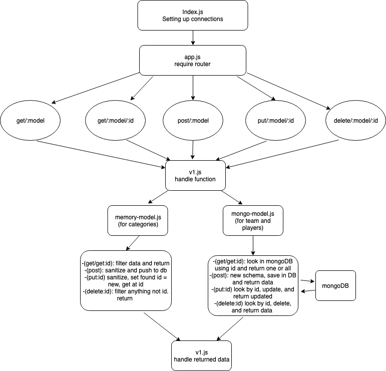

#  LAB

## lab-09-cifp

### Author: Bonnie Wang

### Links and Resources

- [submission PR](https://github.com/401-advanced-javascript-bw/lab-09-cifp/pull/1)
- [travis](https://www.travis-ci.com/401-advanced-javascript-bw/lab-09-cifp)
- [heroku](https://lab-09-cifp.herokuapp.com/)

### Models

#### `categories-model.js`

#### `teams-model.js`

#### `players-model.js`

#### `memory-model.js`

#### `mongo-model.js`

### Schemas

#### `players-schema.js`

#### `teams-schema.js`

### Setup

#### `.env` requirements

- `PORT 8080` - Port Number
- `MONGODB_URI://localhost:27017/lab-08'` - URL to the running mongo instance/db

#### Running the app

- `npm start`
- `nodemon`
- `mongod --dbpath/[path to db]`

#### Tests

- `npm test`
- can GET, POST, PUT, and DELETE categories and products.

#### UML

